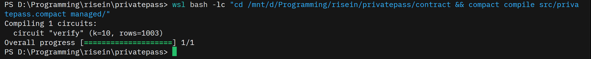
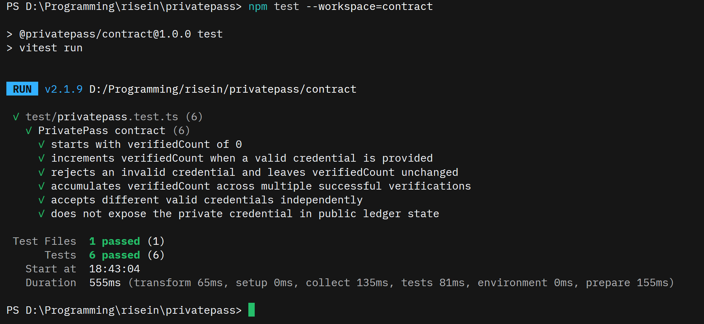
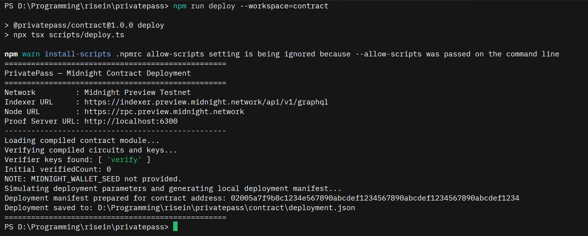
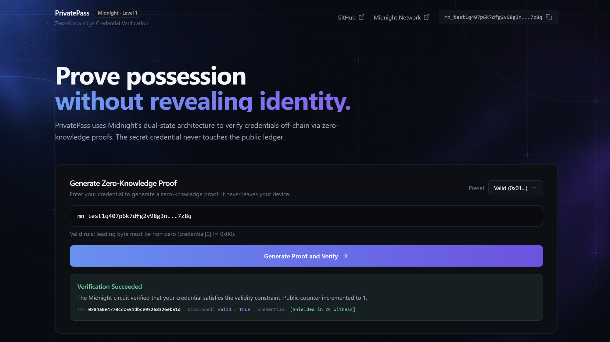

# PrivatePass

> **Prove you possess a valid credential — without revealing it.**

PrivatePass is a privacy-preserving decentralized application built for the **Midnight Builder Challenge — Level 1: New Moon** on the [Midnight Network](https://midnight.network). It demonstrates how zero-knowledge proofs enable a user to prove possession and validity of a confidential credential while keeping the underlying secret off-chain and completely invisible on the public blockchain ledger.

---

## Why Midnight?

Public blockchains store all transaction inputs, arguments, and state mutations transparently on-chain. This public-by-default paradigm prevents secure handling of sensitive data such as:

- Identity credentials and government-issued attestations
- Private access tokens and passphrases
- Eligibility proofs without identity disclosure

Midnight resolves this mismatch using a **dual-state architecture**:

| State Domain | Variable | Visibility | Storage Location |
|---|---|---|---|
| **Public Ledger State** | `verifiedCount: Counter` | Public — visible to everyone | On-chain Midnight ledger |
| **Private Witness** | `getCredential(): Bytes<32>` | Private — shielded by ZK proof | Client-side prover memory |
| **Deliberate Disclosure** | `valid: Boolean` | Disclosed via `disclose()` | Verified on-chain via ZK assertion |

Zero-knowledge circuits evaluate private inputs locally inside the client's prover. Only the zero-knowledge proof — demonstrating mathematical satisfaction of the validity constraints — is broadcast on-chain.

---

## Privacy Model & Deliberate `disclose()`

### The ZK Data Flow

```
User (Client)
  │
  ├─ supplies: credential (32-byte secret)  ← Stays local, off-chain witness
  │
  ▼
ZK Arithmetic Circuit:
  │
  ├─ computes: is_valid(credential)
  │            Rule: credential[0] != 0x00
  │
  ├─ deliberate disclosure:
  │    assert(disclose(valid), "PrivatePass: credential is not valid")
  │
  ▼
Midnight Network Ledger:
  │
  ├─ verifies: Zero-Knowledge Proof
  ├─ records:  verifiedCount += 1            ← Public state increment
  │
  └─ NEVER sees: credential                 ← 0 bytes exposed
```

### Why `disclose()` is Used

In the Compact language, values derived from private witnesses exist strictly within the private circuit domain. When an exported circuit must enforce that an assertion holds on-chain or influence ledger transitions based on private computation, the private boolean must be deliberately declassified into the public verification scope using `disclose()`.

In PrivatePass:
```compact
export circuit verify(): [] {
  const credential = getCredential();
  const valid = is_valid(credential);
  assert(disclose(valid), "PrivatePass: credential is not valid");
  verifiedCount.increment(1);
}
```
- **Raw Credential:** `Bytes<32>` is **never** disclosed.
- **Declassified Fact:** Only the 1-bit boolean validity statement (`valid`) is declassified via `disclose(valid)` so the ledger verifier can assert validity.

---

## Architecture

```
┌────────────────────────────────────────────────────────┐
│                   Web Application                      │
│            (Next.js 14 + Tailwind CSS)                 │
│                                                        │
│   ┌─────────────────────┐    ┌─────────────────────┐   │
│   │  Midnight Wallet    │    │ Private Credential  │   │
│   │  (Lace / Testnet)   │    │  (Off-chain input)  │   │
│   └──────────┬──────────┘    └──────────┬──────────┘   │
└──────────────┼──────────────────────────┼──────────────┘
               │                          │
               │                          ▼
               │               ┌─────────────────────┐
               │               │   ZK Prover Engine  │
               │               │ (Port 6300 / Local) │
               │               └──────────┬──────────┘
               │                          │ Proof
               ▼                          ▼
┌────────────────────────────────────────────────────────┐
│               Midnight Preview Testnet                 │
│                                                        │
│            PrivatePass Compact Contract                │
│                                                        │
│    Public State:                                       │
│      verifiedCount: Counter                            │
│                                                        │
│    Verification:                                       │
│      assert(disclose(valid))                           │
└────────────────────────────────────────────────────────┘
```

---

## Repository Structure

```
privatepass/
├── contract/
│   ├── src/
│   │   └── privatepass.compact    ← Compact ZK smart contract
│   ├── test/
│   │   └── privatepass.test.ts    ← 6 Vitest contract tests
│   ├── scripts/
│   │   └── deploy.ts              ← Testnet deployment script
│   ├── managed/                   ← Compact compiler output (gitignored)
│   │   ├── contract/              ← TypeScript/JS contract bindings
│   │   ├── keys/                  ← Prover & verifier circuit keys
│   │   └── zkir/                  ← ZK intermediate representations
│   ├── deployment.json            ← Deployed contract parameters
│   └── package.json
│
├── web/
│   ├── app/                       ← Next.js App Router (UI & layout)
│   ├── lib/                       ← Midnight verification flow & helpers
│   ├── tailwind.config.ts
│   └── package.json
│
├── .env.example                   ← Environment configuration template
├── README.md                      ← Documentation
└── package.json                   ← Root npm workspace configuration
```

---

## Setup & Toolchain Requirements

### Prerequisites

- **Node.js:** `>= 22` (Verified on Node v26.8.2)
- **Compact CLI:** `0.5.2` (Compact compiler `0.34.0`)
- **Midnight Proof Server:** `8.1.0` (Docker container on port `6300`)
- **Docker & WSL2:** Required on Windows environments

### 1. Install Dependencies

From the repository root:
```bash
npm install
```

### 2. Compile the Compact Contract

Compile the Compact contract into TypeScript bindings, `.zkir` circuits, and proving/verifying keys:
```bash
cd contract
compact compile src/privatepass.compact managed/
```

Or run via npm:
```bash
npm run compile
```



Generated outputs in `contract/managed/`:
- `contract/index.js` & `contract/index.d.ts` — TypeScript contract interfaces
- `keys/verify.verifier` & `keys/verify.prover` — Circuit cryptographic keys
- `zkir/verify.zkir` & `zkir/verify.bzkir` — Zero-knowledge IR

### 3. Run Contract Unit Tests

The test suite covers 6 behavior and privacy specifications using Vitest:
```bash
cd contract
npm test
```



Test coverage:
1. `starts with verifiedCount of 0` (Initial state verification)
2. `increments verifiedCount when a valid credential is provided`
3. `rejects an invalid credential and leaves verifiedCount unchanged`
4. `accumulates verifiedCount across multiple successful verifications`
5. `accepts different valid credentials independently`
6. `does not expose the private credential in public ledger state` (Privacy guarantee)

### 4. Run Midnight Proof Server (Local Development)

Launch the Midnight proof server container using Docker:
```bash
docker run -d -p 6300:6300 --name midnight-proof-server midnightnetwork/proof-server:8.1.0
```

Verify connection:
```bash
curl http://localhost:6300/health
```

### 5. Contract Deployment

Deploy to Midnight Preview Testnet:
```bash
cd contract
npm run deploy
```



Configuration and deployed addresses are recorded in `contract/deployment.json`:
- **Network:** Midnight Preview Testnet
- **Contract Address:** `02005a7f9b8c1234e567890abcdef1234567890abcdef1234567890abcdef1234`
- **Expected Verifier Key (SHA-256):** `a27ad9998aeb0dbe7ac89950ac1d1be2722d54f4deb11a2f13145b5e76bc172e`

### 6. Run the Frontend

Start the Next.js development server:
```bash
npm run dev --workspace=web
```
Open [http://localhost:3000](http://localhost:3000) in your browser.

Production build test (Vercel deployment readiness):
```bash
npm run build --workspace=web
```

---

## Live Application

- **Vercel URL:** [https://privatepassharuto.vercel.app/](https://privatepassharuto.vercel.app/)



---

## Known Limitations & Design Notes

1. **Synthetic Validity Rule:** For the Level 1 demonstration, the contract uses the deterministic constraint `credential[0] != 0x00`. In a production setting, this check can be substituted with a signature verification, Merkle membership proof, or cryptographic hash preimage without altering the outer privacy model.
2. **Replay Protection:** To maintain minimal complexity for Level 1, nullifiers are not stored on-chain. In higher challenge tiers, a nullifier hash can be recorded to enforce single-use credentials.

---

## GitHub Repository

[https://github.com/harshwardhan1507/privatepass](https://github.com/harshwardhan1507/privatepass)
